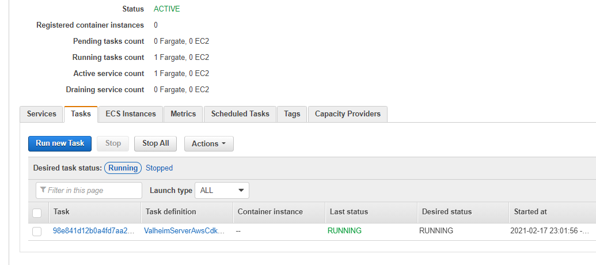

# valheim-ecs-fargate-cdk


This is a CDK Project for spinning up a [Valheim](https://store.steampowered.com/app/892970/Valheim/) game server on AWS Using [ECS Fargate](https://aws.amazon.com/fargate/?whats-new-cards.sort-by=item.additionalFields.postDateTime&whats-new-cards.sort-order=desc&fargate-blogs.sort-by=item.additionalFields.createdDate&fargate-blogs.sort-order=desc) and [Amazon EFS](https://aws.amazon.com/efs/)!

Uses [valheim-server-docker](https://github.com/lloesche/valheim-server-docker) - thanks to lloesche for putting it together!

## Table of Contents
- [Installation](#installationdeployment)
- [Configuration](#configuration)
- [Cost Information](#solution-cost-information)
- [FAQ](#common-problemsfaq)
  * [Find your server IP](#how-do-i-find-the-ip-of-my-server)

## Installation/Deployment

Making the assumption you have an AWS Account Already and a valid set of creds configured:

1. Create a Secret named **valheimServerPass** in the same region you plan to deploy the CDK Stack - we reference it by name [here](lib/valheim-server-aws-cdk-stack.ts#L14-17) and pass that value to our container as a secret. valheim-server-docker requires this to be AT LEAST 5 characters (ideally much more). The secret string should be a key value pair as below:

```bash
aws secretsmanager create-secret --name valheimServerPass --secret-string '{"VALHEIM_SERVER_PASS":"SuperSecretServerPassword"}'
```

2. Clone down our source code:

```bash
git clone git@github.com:rileydakota/valheim-ecs-fargate-cdk.git
```

3. Install dependencies:

```bash
npm i
```

4. Configure any server settings you need to change in the code [here](lib/valheim-server-aws-cdk-stack.ts#L66-82) - will absolutely want to change `SERVER_NAME`!

```typescript
    const container = valheimTaskDefinition.addContainer("valheimContainer", {
      image: ecs.ContainerImage.fromRegistry("lloesche/valheim-server"),
      logging: ecs.LogDrivers.awsLogs({ streamPrefix: "ValheimServer" }),
      environment: {
        SERVER_NAME: "YOUR_SERVER_NAME_HERE",
        SERVER_PORT: "2456",
```

5. Assuming you have already bootstrapped your account via the CDK (see [here](https://docs.aws.amazon.com/cdk/latest/guide/bootstrapping.html) if not) - deploy the stack

```
npx cdk deploy
```

6. enjoy accidentally chopping trees onto your friends powered by AWS!

## Configuration

Coming soon

## Solution Cost Information

Coming soon

## Common Problems/FAQ

### How do I find the IP of my server?

#### Via the ecs-cli:

Install the ecs-cli by running the following (this assumes Linux - for other environments see [here](https://docs.aws.amazon.com/AmazonECS/latest/developerguide/ECS_CLI_installation.html))

```bash
sudo curl -Lo /usr/local/bin/ecs-cli https://amazon-ecs-cli.s3.amazonaws.com/ecs-cli-linux-amd64-latest
```

Using the Cluster Name outputted by successfully running the CDK template - run the following command:

```bash
ecs-cli ps --cluster YOUR_CLUSTER_NAME_GOES_HERE_CHANGEME
```

You will be presented with the public ip of your server as follows:

```bash
Name                                                                                                            State    Ports                                                                                     TaskDefinition                                            Health
ValheimServerAwsCdkStack-fargateCluster7F3D820B-AxbOSXn1ghAs/8d190269c9df4d3e9709dccb89bdf3d8/valheimContainer  RUNNING  1.1.1.1:2456->2456/udp, 1.1.1.1:2457->2457/udp, 1.1.1.1:2458->2458/udp  ValheimServerAwsCdkStackvalheimTaskDefinitionB5805DE1:17  UNKNOWN
```

Game server runs on port 2456 (unless changed)

#### Via the AWS Console: 
goto the ECS Service page (click the services dropdown and select ECS - or click [here](https://us-east-2.console.aws.amazon.com/ecs) if you are in us-east-2). From here - you will see a Cluster listed. Click the cluster name to continue to the details page.


At the bottom half of the screen - click the Tasks tab tab - you should see a "Task ID". Click the task id to continue to the next page.


Finally - the public IP of your server will be listed here - under the Network section. Connect to the server using the IP and port 2456!


---

## To-Do

Coming soon
